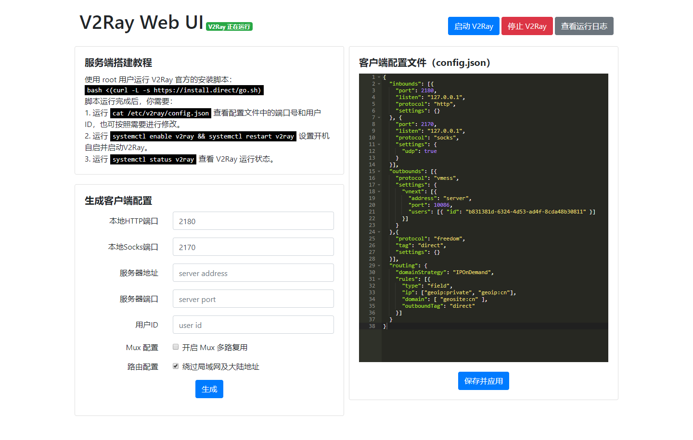

# V2RayWebUI
V2Ray Web UI 是 V2Ray 的一个基于 Web 的客户端，功能特性：

- 简易服务端搭建教程
- 简易客户端配置文件生成
- 设置系统默认代理
- 网页支持启动与停止 V2Ray 客户端
- 网页支持查看 V2Ray 客户端运行日志
- 网页支持编辑与应用 V2Ray 配置，支持检查 V2Ray 配置 JSON 语法，如果错误则不能保存

下载地址：[Releases](https://github.com/v2raywebui/V2RayWebUI/releases)

配置文件V2RayWebUI.ini：
```
# V2Ray Web UI 监听地址和端口
listen = 0.0.0.0
port = 2100
# 当 V2Ray Web UI 启动时自动打开浏览器页面
open_browser = true
# 设置系统默认代理端口
set_system_proxy_port = 2180
```

界面预览：

